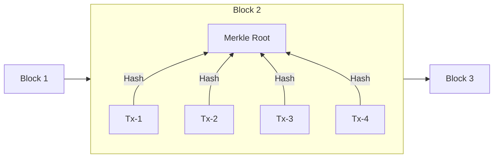
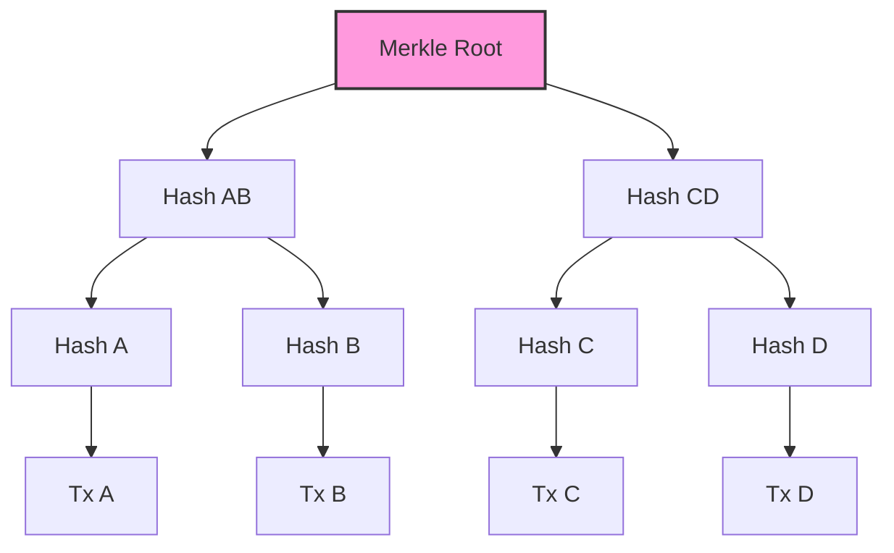
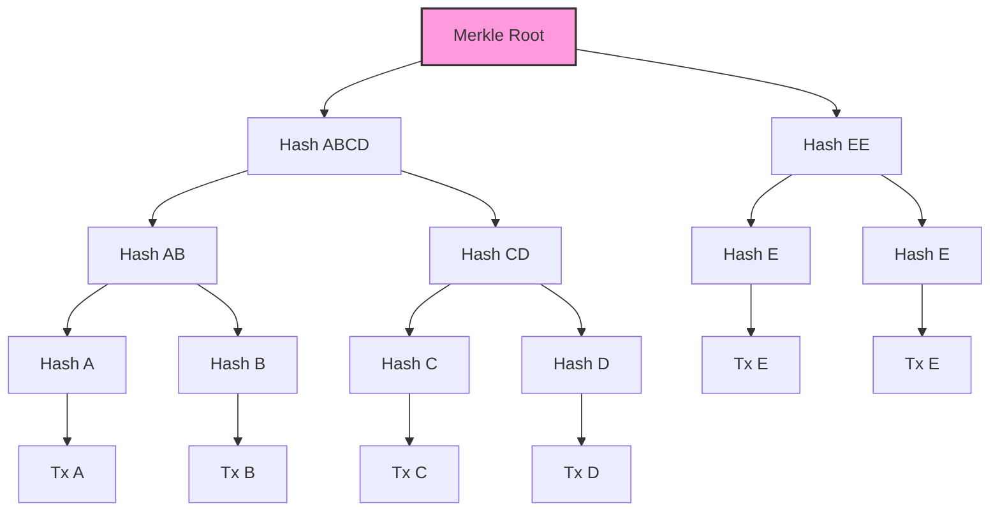
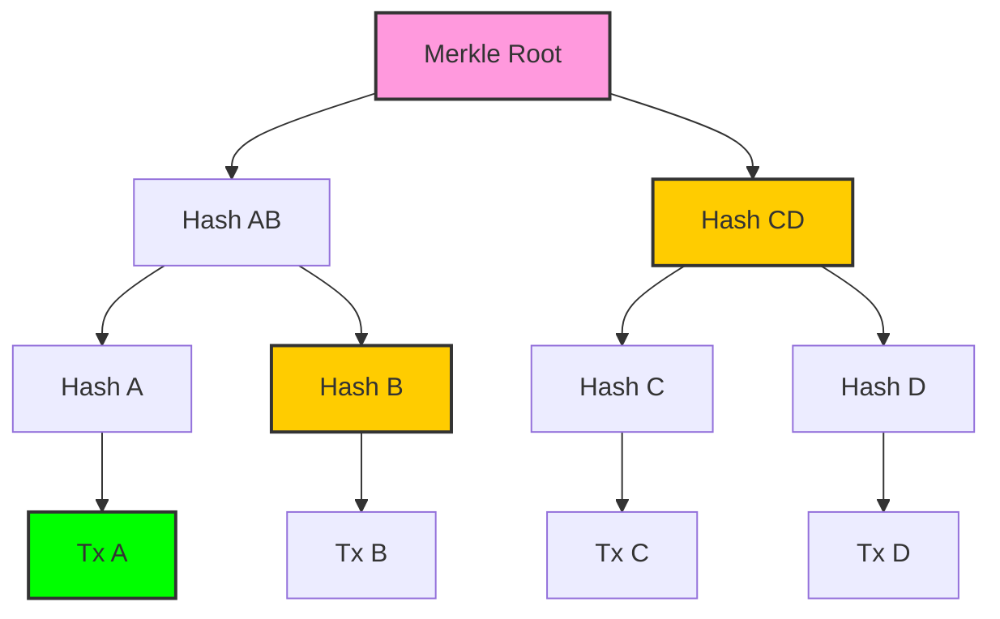
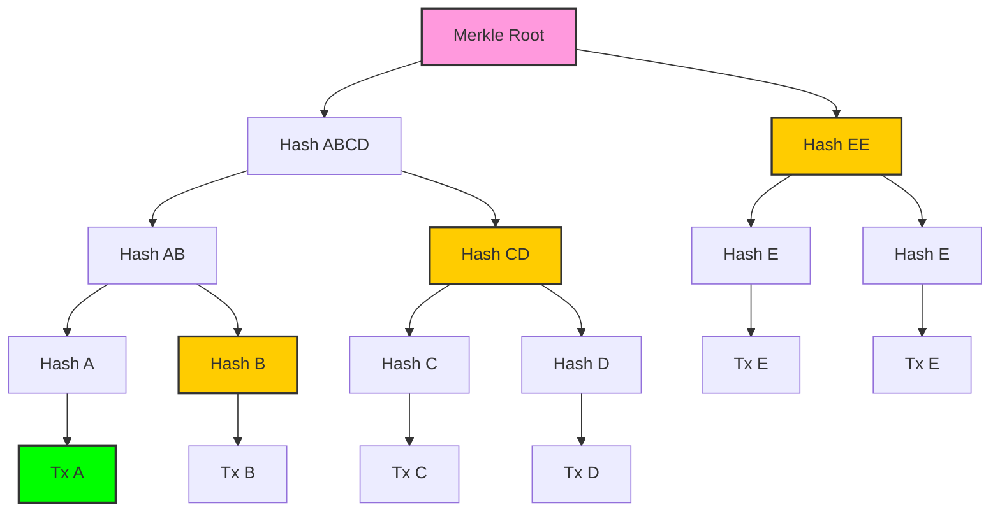

# Merkle Tree

Merkle trees are a way to verify the integrity of data which means if you have a small/medium/large datasets & want to form a group. Now, in order to prove if a data element is a part of the group, then you can use Merkle tree to verify it.

Merkle trees are used in blockchains to verify if a transaction is a part of a block or not. It is also used in IPFS to verify if a file is a part of a directory or not.

Each block contains merkle root irrespective of transactions. The merkle root is calculated by hashing the hashes of all transactions in the block. This merkle root is then used to verify if a transaction is a part of the block or not.

Ethereum uses Patricia Merkle tree to store the state of the blockchain. It is a modified version of Merkle tree.

> For any immutable data (i.e. no change required) like txs added in blocks, standard merkle tree is enough. But, for mutable data (i.e. change required) like state of blockchain, Patricia merkle tree is used as it also stores the changelog of the data.

## Tree formation

### Even leaves

### Odd leaves

## Proof

### Single

This is about proving if a transaction is a part of a block or not. So, here the transaction is the leaf node & block has a merkle root field.

#### Even leaves

#### Odd leaves

### Multiple

Verifying multiple txs in a block. So, the proof size would be lesser in size than that of single tx proof.
