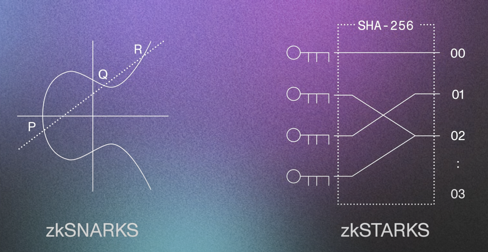

# Zero-Knowledge Proof

## Concepts

There are 3 main components in a ZKP system:

- **Prover**: The party that wants to prove the knowledge of a secret without revealing it. Here, the prover has to generate the proof from witness and send it to the verifier.
- **Verifier**: The party that wants to verify the prover's knowledge of the secret without learning the secret itself. Here, the verifier has to verify the statement sent by the prover. In blockchain systems, the verifier can be available in form of a smart contract or node.
- **Statement**: The claim or assertion that the prover wants to prove without revealing any additional information (non-interactive). It is the fact or proposition that the prover knows to be true and wants to convince the verifier of its truth without disclosing any sensitive details. The return type for Statement is always bool i.e. `true`/`false`.

There are 2 additional components that are used in ZKP systems:

- **Witness**: It's a secret (like private key in a cryptographic keypair) information that the prover knows. The witness is used to generate the _proof_ (like cryptographic signature formed after signing).

  Mathematically, for instance a secret info is a point that lies on a straight line or curve. Now, the curve is the actual information and the point is the witness. And the verifier can verify the statement using proof with some arbitrary point(s) on the curve and hence, the witness is not known and still the statement is verified. [Code example](../../../proj/zkp/langs/noir/hello). In this code example, the statement is pretty simple `x != y`. But we can have more complex statements.

- **Proof**: It is a cryptographic evidence generated by the prover to convince the verifier of the statement's truth without revealing the witness (the secret information that the prover knows). In ZKP systems, the proof (like a cryptographic signature) is designed in such a way that it does not leak any sensitive information about the witness (like private key), and the verifier can independently verify the proof without back-and-forth communication. In Aztec protocol, using noir we can create a statement that satisfies the points like witness (secret) and inputs (`Prover.toml` file content). Then, we can generate the proof using `noir prove` command. And finally, we can verify the proof using `noir verify` command. [Code example](../../../proj/zkp/langs/noir/hello).

---

There are 3 properties of a ZKP system/protocol [1]:

- **Completeness**: If the proof is valid, it must be accepted by the verifier (ie. a correct proof is always accepted).
- **Soundness**: If the proof is invalid, it must be rejected by the verifier (ie. the probability that a verifier accepts an incorrect solution is negligible).
- **Zero-Knowledge**: The verifier does not learn any information about the information that the prover claims to know other than the assertion that she knows it.

## Types

There are mainly 2 types of ZKP protocols:

- **zkSNARK** (Zero-Knowledge Succinct Non-Interactive Argument of Knowledge)
- **zkSTARK** (Zero-Knowledge Scalable Transparent Argument of Knowledge)

Difference under the hood looks like this:



Here, you can notice that zkSNARKs need the elliptic curve. Examples of KZG commitment scheme over BLS12-381 curve, groth16 over BN256 curve etc. In short, there are many schemes like Groth16, Plonk, KZG, etc. that are fit as zkSNARKs (as they fulfill the properties like succinct proof, non-interactive, trusted setup required) with a specific elliptic curve.

---

Other types include:

1. **Mixers**
   1. Centralized imagine Alice, Bob, Charlie want to send to some other addresses. And here the mixer is the trusted party that might take away the money and not send it to the destination address. So, we need to trust the mixer.
   2. Decentralized as smart contract using ZKP circuits, like tornado.cash. Here, the mixer is the smart contract. Here, the funds go through the mixer that is effectively a verifier contract that allows the receiver to withdraw the funds if they provide some kind of proof that they are the owner of the funds.
2. **Commit-Reveal** aka Commitments
   Here, imagine 3 players are playing a game Rock-Paper-Scissors (RPS) and each one has to _commit_ (via hashing, polynomial), and then during declaring result, everyone has to _reveal_, otherwise considered as cheater.

## Applications

### Blockchain

Zero-Knowledge Proof (ZKP) is a cryptographic technique that addresses two major issues in blockchain technology: scalability and privacy. In a ZKP, one party (the prover) can prove to another party (the verifier) that a given statement is true, without revealing any information beyond the fact of the statement's truth. This technique has significant implications for blockchain technology.

#### Scalability

Blockchain networks face scalability challenges due to the need for every node to verify data. This full node verification process can lead to slower transaction times and increased network congestion. ZKP offers a solution to this problem by allowing a single verifying node to verify the submitted proof for the data sent to the network. Other nodes can then simply add the verified data (by one node) into their local copy of the blockchain, resulting in reduced finality time and increased scalability.

#### Privacy

In public blockchains, all data is visible, which can lead to privacy concerns. ZKP-based cryptography, such as the BLS family of Elliptic Curves, can guarantee privacy by allowing users to prove the validity of a statement without revealing the statement itself. This enables confidential transactions and data sharing while maintaining the security and integrity of the blockchain. We can have smart contracts that can verify the data without revealing the data proof. For example, a smart contract can verify that a user is over 18 years old without revealing the user's age. For this, we need to generate a Verifier SC (smart contract) that can verify the proof. Using Aztec noir, we can do this.

### Voting

ZKP can be used to ensure the integrity of voting systems. For example, a voter can prove that they voted for a particular candidate without revealing their identity or the candidate they voted for. This allows for anonymous voting while ensuring that the votes are counted correctly.

### Login systems

ZKP can be used to authenticate users without revealing their identity. For example, a user can prove that they have a valid login credential without revealing their username or password. This allows for anonymous authentication while ensuring that the user is authorized to access the system.

### Where is Waldo?

Please refer to the corresponding section here[1].

- <u>Prover</u>: You
- <u>Verifier</u>: Your friend.
- <u>Witness</u>: location of Waldo in puzzle.
- <u>Proof</u>:
  - M-1: Cut-out of Waldo using scissor with backside watermarked with puzzle-name all over. So that the cut-out is genuine and taken from the puzzle.
  - M-2 (Recommended): A piece of paper larger than the puzzle shape (rectangle) with a hole. Now, put the paper over the puzzle at the position of Waldo as a proof to show that Waldo is in the puzzle.
- <u>Statement</u>: Waldo is in the puzzle.

This example is **non-interactive**.

### Color Blindness

Please refer to the corresponding section here[1].

- <u>Prover</u>: You
- <u>Verifier</u>: Your friend who is color-blind
- <u>Witness</u>: color of the ball (red or blue).
- <u>Proof</u>: Hide the ball behind the back and switch the ball or not. Then, show the ball to the verifier. The verifier has to guess whether the ball is switched or not.
- <u>Statement</u>: The ball is switched or not switched.

This example is **interactive**. Because, the verifier has to ask the prover to reveal whether the ball is switched or not. Revealing the color to the verifier (color-blind) is not enough as the verifier can't verify the statement himself.

Maybe, we can use a **non-interactive** example here. But, I am not sure how to do that.

Here, the proof is zero-knowledge because the verifier can't learn anything about the color of the ball. The verifier can only verify the statement.

---

Mathematically, we can represent the probability like this:

```math
p^n = 2^(-128)

where,

p: probability
n: iterations
```

p can be 1/2 (switched or not switched).

For large no. of iterations, the probability of guessing the incorrect color is (1/2)ˆ128 (for 128 iterations) ~ 2.9387358770557188e-39. So, the probability of guessing the incorrect color is negligible. Hence, the prover can't cheat.

### Finance

1. <u>Payment</u>: In order to send some tokens to my friend, I just need to generate a **ZK-proof** that proves that I have balance more than the transaction amount. This is called a balance proof. The validator will verify the balance proof submitting a tx containing the ZKP to a **Verifier contract** by checking that the balance is greater than the transaction amount.
2. <u>Loans</u>: In order to apply for loans, ideally I need to submit bank statements to the bank to proof I had consistent bank statements. But, now I can instead generate a **ZK-proof** that I have a consistent bank statement. And then the bank can just verify the bank statement by submitting a tx containing the ZKP to a **Verifier contract**.

> Here, in both use cases, the verifier (bank/validator) takes less time and also the prover (customer) gets to keep its data private.

## Development

### Hash function

Please refer to the corresponding section here[1].

- <u>Prover</u>: You
- <u>Verifier</u>: Smart contract

## Resources

1. [What the heck is a Zero-Knowledge Proof, anyway?](https://www.zkcamp.xyz/blog/what-is-a-zkp-anyway)
2. [DeFi MOOC Lecture 10: Privacy on the Blockchain YT playlist](https://www.youtube.com/playlist?list=PLS01nW3RtgorEzMOg2dpg7KwB5nhQHhSw) 🧑🏻‍💻
